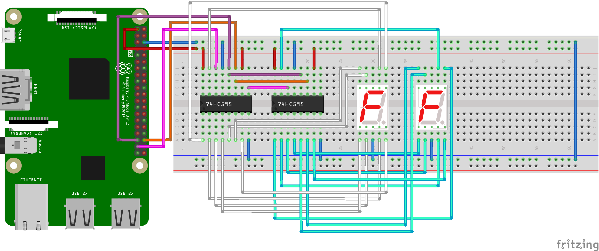
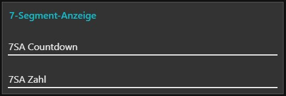

# 7-Segment-Anzeige

Die in diesem Repository enthaltenen Dateien ermöglichen das Ansteuern zweier 7-Segment-Anzeigen mithilfe von Schieberegistern des Types 74HC595 über einen Raspberry Pi mit Python.

Entweder kann eine einzelne Ziffer angezeigt werden oder ein Countdown von maximal 99 abwärts.

## Schaltplan

## Nutzung
Zur Ansteuerung gibt es jeweils drei Möglichkeiten (erkennbar am Dateinamen):
  * Benutzereingabe im Python-Fenster `python3 7SA_Countdown_Benutzer.py`
  * Parameter beim Start über die Shell `python3 7SA_Countdown_Shell.py 10`
  * Mitteilung des Wertes über MQTT: `python3 7SA_Countdown_MQTT.py`

### MQTT
Zunächst muss der Python MQTT Client mittels `pip3 install paho-mqtt` installiert werden.

In den entsprechenden Dateien muss die IP-Adresse des MQTT-Brokers unter `client.connect("192.168.x.x", 1883, 60)` eingetragen werden.

Die standardäßigen MQTT-Topics lauten:
  * Countdown: `7-SA/Countdown`
  * Zahl: `7-SA/Zahl`

Das Programm _7SA_MQTT.py_ kann sowohl einen Countdown als auch eine einzelne Ziffer anzeigen. Dies wird anhand des Topics entschieden.

## NodeRED
Der enthaltende Flow ermöglicht sowohl das Anzeigen einer einzelnen Zahl als auch eines Countdowns.

